# I. Distribución de la población indígena 

## Porcentaje de personas pertenecientes o descendientes de un pueblo indígena en comparación a aquellos que no
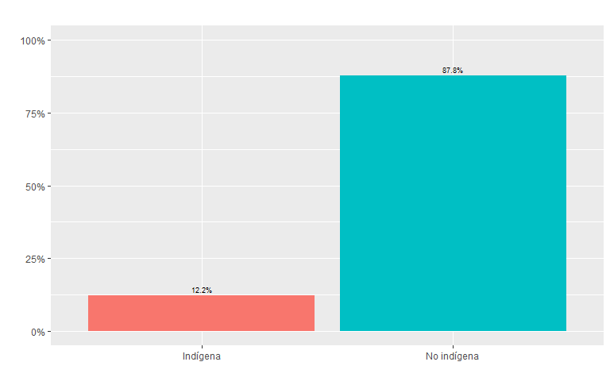

## Porcentaje de personas pertenecientes o descendientes de un pueblo indígena en comparación a aquellos que no según región (3 principales)
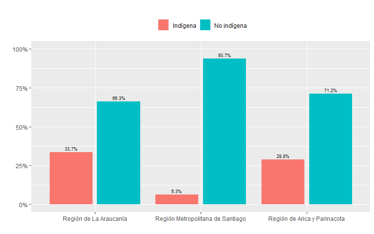

## Porcentaje de étnias indígenas a la que pertenence o desciende
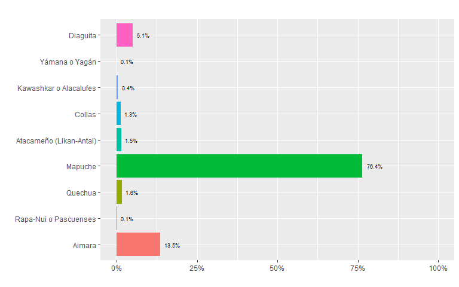

## Porcentaje de étnias indígenas de pertenencia o descendencia según región
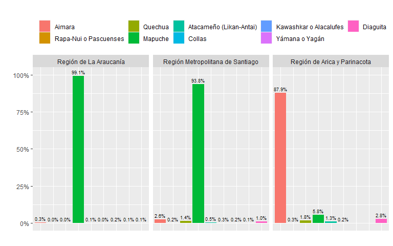

## Porcentaje de étnias indígenas de pertenencia o descendencia según región (macrozona norte)
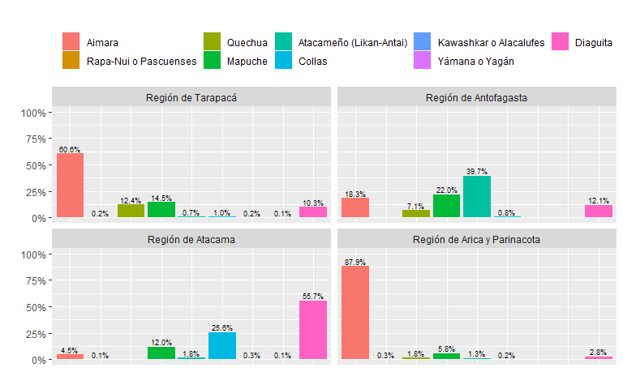

## Porcentaje de étnias indígenas de pertenencia o descendencia según región (macrozona centro)
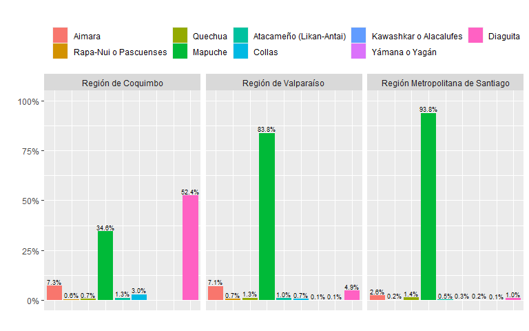
## Porcentaje de étnias indígenas de pertenencia o descendencia según región (macrozona centro sur)
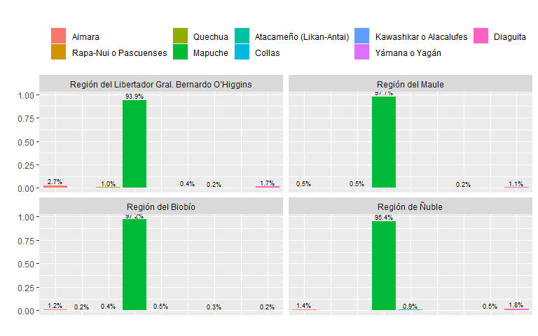

## Porcentaje de étnias indígenas de pertenencia o descendencia según región (macrozona sur)
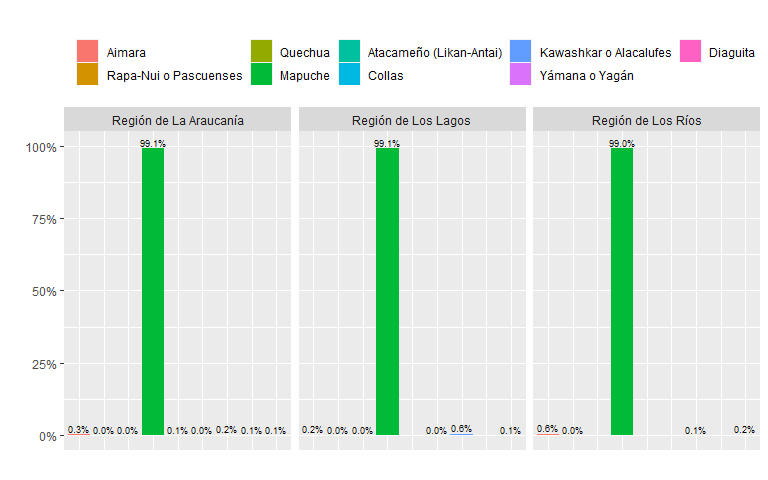

## Porcentaje de étnias indígenas de pertenencia o descendencia según región (macrozona austral)
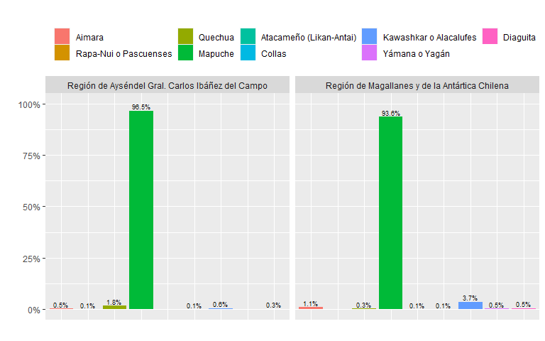

## Cantidad de personas pertenecientes a una etnia indígena que hablan o entienden alguna lengua indígena
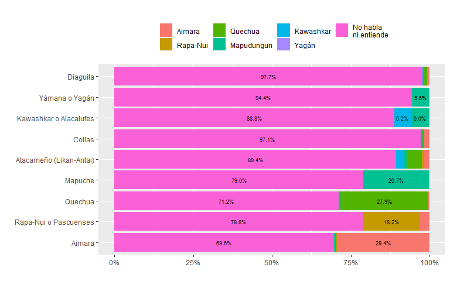

# II. Nivel educacional de la población indígena

## Nivel educacional según pertenencia o no pertenencia a etnia indígena
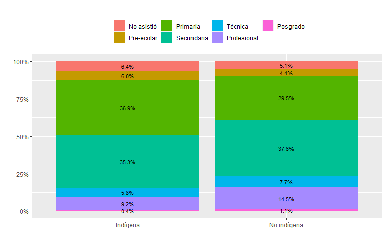

## Nivel educacional según pertenencia o no pertenencia a etnia indígena y sexo
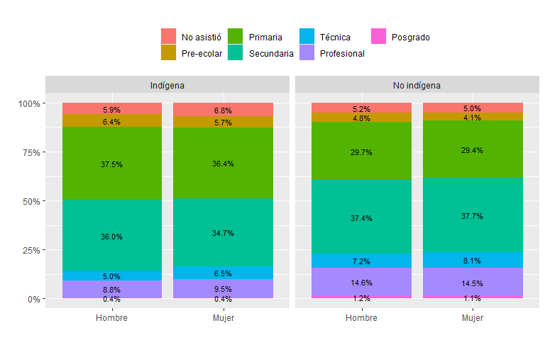

## Nivel educacional según etnia a la que pertenence
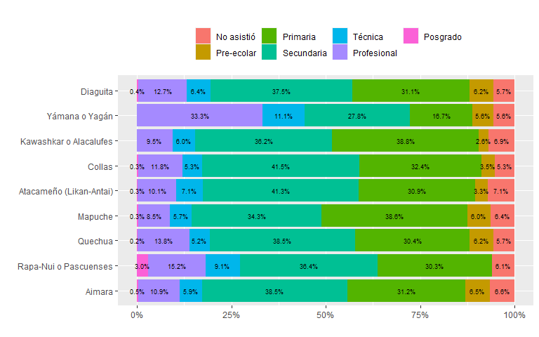

## Nivel educacional de la madre según etnia a la que pertenence 
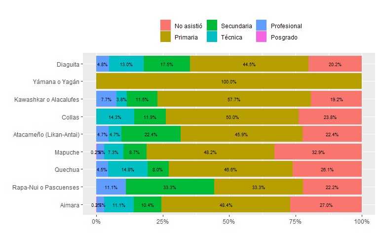

## Nivel educacional del padre según etnia a la que pertenence 
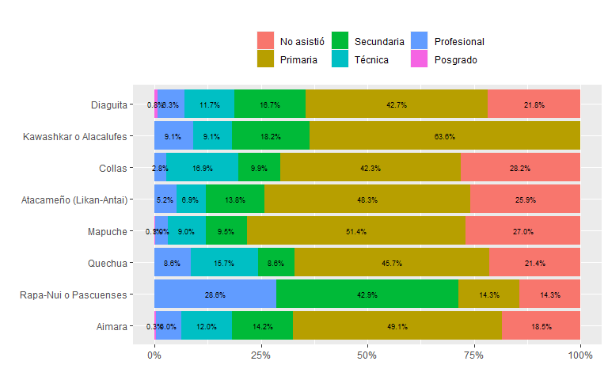

# III. Tipo de trabajo de la población indígena

## Tipo de trabajo según pertenencia o no pertenencia a etnia indígena
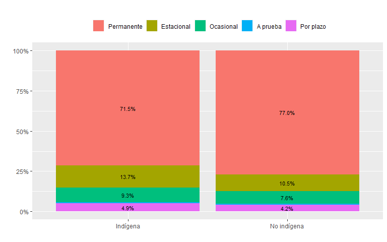

## Tipo de trabajo según pertenencia o no pertenencia a etnia indígena y sexo
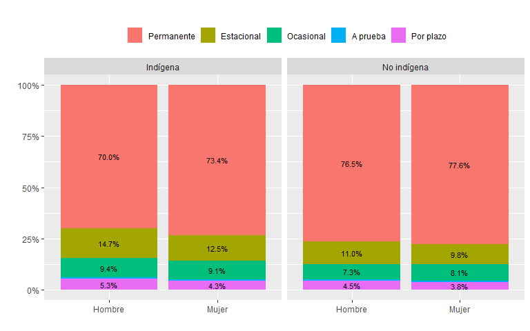

## Tipo de trabajo según etnia indígena a la que pertence
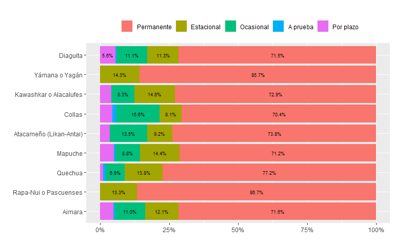

